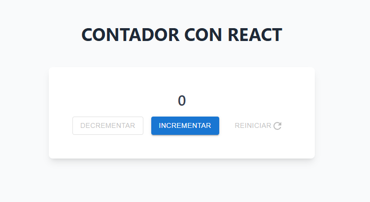
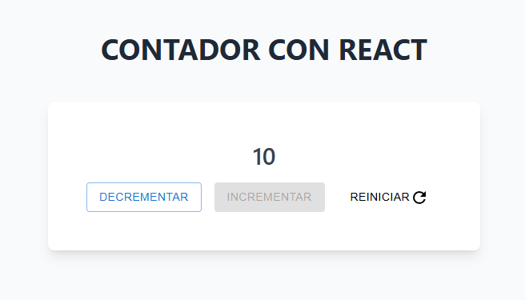
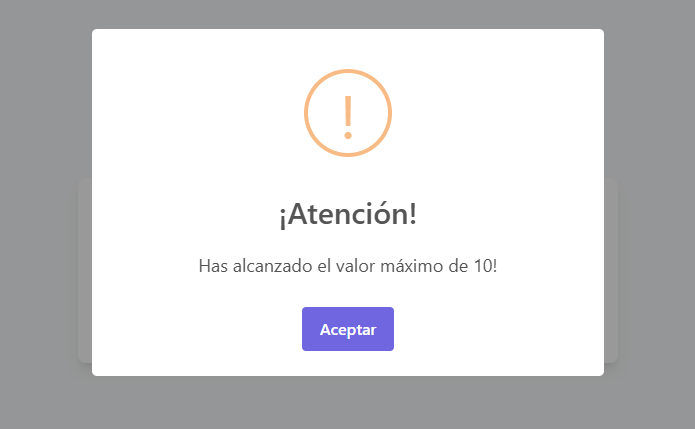
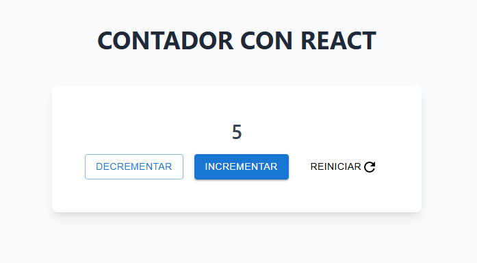

# CONTADOR CON REACT (PRUEBA TÉCNICA)

## Requisitos de la prueba 📃

### Básicos 👌:

- Mostrar un contador con un valor inicial de 0.
- Botones para incrementar y decrementar el valor.
- Botón para reiniciar el contador a 0.

### Opcionales ✨:

- No permitir que el contador baje de 0.
- Mostrar un mensaje cuando se alcance un número máximo (por ejemplo, 10).

## Resumen del proyecto realizado 👁️

Este proyecto, se basa en un contador que incia desde cero y permite al usuario incrementar el valor de uno en uno, decrementarlo de uno en uno también y reiniciar el valor de nuevo a cero. Por otro lado, se han marcado ciertos límites; el usuario no podrá bajar el contador a menos de 0, ni podrá aumentarlo a más de 10. A continuación, se explican los detalles que se han tenido en cuenta para que este contador sea intuitivo para el usuario. 

### Experiencia de usuario 🔝

Para una mejor experiencia de usuario, se ha creado un diseño simple, intuitivo, coherente y agradable a la vista. Se ha tenido en cuenta la consistencia en cuanto a los colores y tipografía, el espaciado coherente y la legibilidad y el uso de un contraste adecuado para facilitar el manejo del contador al usuario. Se han diferenciado tres tipos de botones: primario, secundario y terciario, facilitando así las interacciones del usuario y centrando sus acciones hacia donde queremos. A continuación se muestran unas capturas de pantalla en las que se podrán apreciar estos detalles:

- Por un lado, con el objetivo de no confundir al usuario, se ha definido que el botón de "decrementar" y "reiniciar", aparezcan deshabilitados cuando el contador esté a cero, ya que estos dos botones no serían necesario en ese momento.



- Por otro lado, cuando el contador llega a 10 que es el número máximo al que puede ascender el usuario, el botón de "incrementar" se deshabilita porque carece de funcionalidad. 



-Además, cuando el contador llegue a 10, aparecerá una alerta creada con "SweetAlert2" que avisará al usuario de que ha alcanzado la cifra máxima y, para evitar que esta alerta se cierre por error o sin leer, se ha definido que el usuario tenga que hacer click sobre el botón de "Aceptar" para cerrarla y poder acceder de nuevo al contador. 



- En cambio, si el contador se encuentra en una cifra que sea supeior a 0 e inferior a 10, el usuario tendrá todos los botones habilitados, ya que todos ellos tendrían utilidad. 



## Herramientas utilizadas 🛠️

- **React**: Biblioteca de JavaScript para construir interfaces de usuario interactivas.
- **Vite**: Herramienta de desarrollo y construcción rápida para aplicaciones web.
- **Material UI**: Material-UI: Biblioteca de componentes basada en Material Design, utilizada en este proyecto para crear botones reutilizables y consistentes con un diseño atractivo, intuitivo y funcional.
- **Prop-Types**: Biblioteca utilizada para validar las propiedades de los componentes en React, garantizando que reciban los datos en el formato esperado y ayudando a prevenir errores en tiempo de desarrollo.
- **Tailwind CSS**: Framework CSS para crear interfaces personalizadas de forma rápida.
- **SweetAlert2**: Biblioteca para mostrar alertas personalizadas.
- **ESLint**: Herramienta para analizar el código y garantizar buenas prácticas, ayudando a mantener un código limpio, libre de errores y facilitar la escalabilidad.

## Estructura del proyecto 👣

Este proyecto ha sido estructurado y diseñado para garantizar un desarrollo rápido, escalable y fácil de mantener. La modularización en componentes y hooks asegura que el código sea limpio y reutilizable, lo que facilita la ampliación y el mantenimiento del proyecto a medida que crece.

prueba_tecnica_contador/
├── node_modules/                        
├── src/
│   ├── assets/ 
│   │     └── imagesReadme/                 
│   ├── components/         
│   │   └── buttons/ 
│   │         └── PrimaryButton.jsx/
│   │         └── SecondaryButton.jsx/
│   │         └── TertiaryButton.jsx/ 
│   │     └── Counter.jsx/         
│   ├── hooks/
│   │     └── CounterHook.jsx/  
│   ├── pages/  
│   │    └── Home.jsx/   
│   └──               
├── App.jsx                
├── index.css              
├── main.jsx                        
├── .gitignore 
├── eslint.config.js
├── index.html    
├── package-lock.json            
├── package.json            
├── postcss.config.js 
├── README.md        
├── tailwind.config.js        
└── vite.config.js            

## Configuración ⚙️

Para configurar y ejecutar el proyecto, sigue estos pasos:

1. Clona este repositorio en tu local:

   ```bash
   git clone https://github.com/devegalaura-dev/prueba_tecnica_contador_react

2. Instala las dependencias del frontend:

    ```bash	
    npm install

3. Inicia tu servidor del frontend:

    ```bash	
    npm run dev´

## Conclusión ✨

Este proyecto es la primera prueba técnica que hago para una empresa. En él, he podido demostrar mis habilidades en el desarrollo web, utilizando React, Vite, y otras herramientas como Material UI, Tailwind CSS, y SweetAlert2. Este reto me ha permitido reforzar mis conocimientos, aplicando las buenas prácticas aprendidas. Este repositorio marca un antes y un depsués en mi carrera profesional. 🚀🚀
